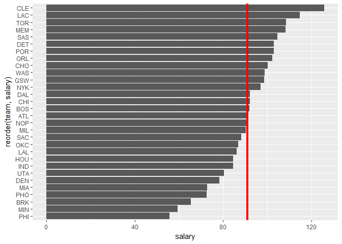
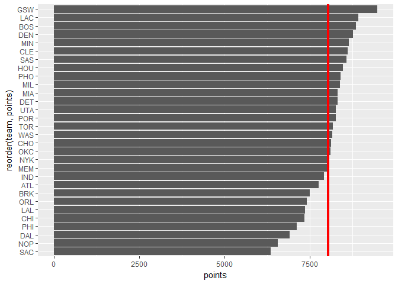
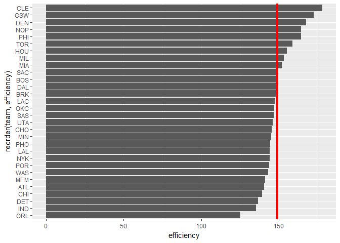
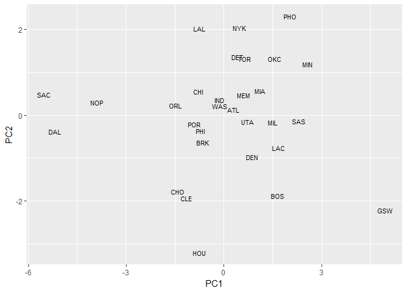
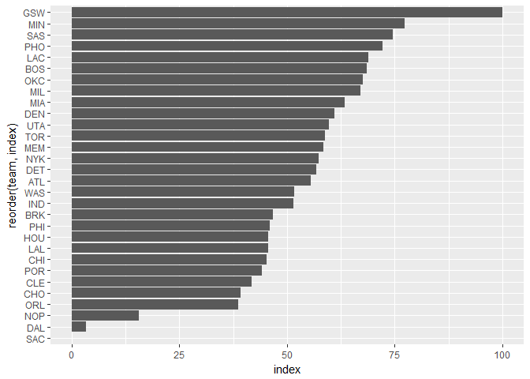

hw03-yanxin-zhu.Rmd
================

load data file
==============

``` r
library(ggplot2)
```

    ## Warning: package 'ggplot2' was built under R version 3.4.1

``` r
teams<-read.csv("C:/Users/mycpu/Desktop/about_work/about_work/work/begin/work8/hw03/data/nba2017-teams.csv")
```

ranked by Total Salary
----------------------

``` r
ggplot(teams,aes(x=reorder(team,salary), y=salary))+geom_bar(stat='identity')+geom_hline(yintercept=mean(teams$salary),col='red',lwd=1.5) +coord_flip()
```



ranked by Total Points
----------------------

``` r
ggplot(teams,aes(x=reorder(team,points), y=points)) +
  geom_bar(stat='identity')+geom_hline(yintercept=mean(teams$points),col='red',lwd=1.5)+coord_flip()
```

 \#\# ranked by efficiency

``` r
ggplot(teams,aes(x=reorder(team,efficiency), y=efficiency)) +
  geom_bar(stat='identity')+geom_hline(yintercept=mean(teams$efficiency),col='red',lwd=1.5) +coord_flip()
```



Principal Components Analysis (PCA)
-----------------------------------

``` r
pca_data<-subset(teams,select = c( 'points3','points2','free_throws','off_rebounds'
,'def_rebounds','assists','steals','blocks','turnovers','fouls'))
pca_result<-prcomp(pca_data,scale. = TRUE)
pca_summary<-summary(pca_result)
eigenvalues<-data.frame(eigenvalue=(pca_summary$sdev)^2,prop=pca_summary$importance[2,]
                        ,cumprop=pca_summary$importance[3,])
eigenvalues
```

    ##      eigenvalue    prop cumprop
    ## PC1  4.69588631 0.46959 0.46959
    ## PC2  1.70201009 0.17020 0.63979
    ## PC3  0.97952464 0.09795 0.73774
    ## PC4  0.77171938 0.07717 0.81491
    ## PC5  0.53408824 0.05341 0.86832
    ## PC6  0.47801622 0.04780 0.91612
    ## PC7  0.38220374 0.03822 0.95434
    ## PC8  0.26026243 0.02603 0.98037
    ## PC9  0.13359274 0.01336 0.99373
    ## PC10 0.06269622 0.00627 1.00000

``` r
pca1<-pca_result$rotation[,1]
pca2<-pca_result$rotation[,2]
pca_data<-scale(pca_data)
x_pca1<-as.matrix(pca_data)%*%as.matrix(pca1)
y_pca2<-as.matrix(pca_data)%*%as.matrix(pca2)
plotdata<-data.frame(x=x_pca1,y=y_pca2,label=teams$team)
ggplot(data = plotdata, mapping = aes(x = x, y =y))+geom_text(aes(label=label),size=3)+labs(x = "PC1",y = "PC2")
```



``` r
new_index<-as.matrix(pca_data)%*%as.matrix(pca1)
new_index<-(new_index-min(new_index))/(max(new_index)-min(new_index))*100
plotdata<-data.frame(index=new_index,team<-teams$team)

ggplot(plotdata,aes(x=reorder(team,index),y=index))+geom_bar(stat='identity')+coord_flip()
```



we can see that GSW ranks first and SAC ranks last
