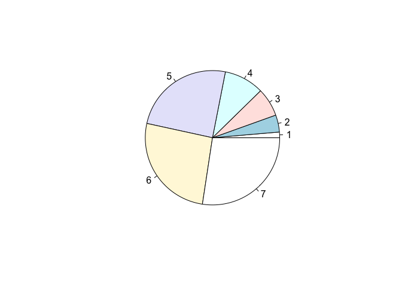
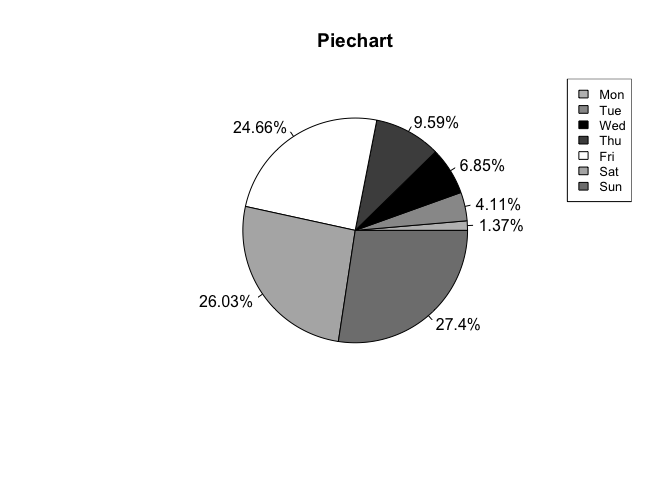
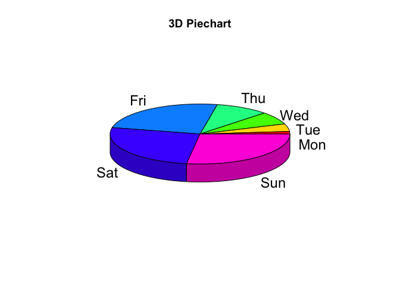

How To Make Pie Charts
================
Yanxin Zhu
10/29/2017

``` r
library(ggplot2)
```

Introduction
------------

In this post, I'm going to explore how to make pie charts in R. Pie charts can easily help us to compare individual portions with the whole entity, and they are widely used in Excel and other analytical tools, so I wonder if I can also use R to make pie charts for data visualization. My topics include the following 3 parts: 1. basic pie chart with some decorations 2. how to change color, add percentages and legend 3. how to create a 3D pie chart

Why do we use pie charts?
-------------------------

Pie charts give you a snapshot of how a group is broken down into smaller pieces. They are best to use when you are trying to compare parts of a whole. Pie charts are useful to visualize information that might be presented in a small table.So they are easy to understand, and easily communicate a simple proportion.

What data can be presented using a pie chart?
---------------------------------------------

1.  A pie chart is best used when trying to work out the composition of something,so they are useful for displaying data that is classified into nominal or ordinal categories.
2.  Pie charts are good for displaying data for around 6 categories or fewer.

First let us create some simple data: Here's a vector of data, one for each day of the week.

``` r
A <- c(1, 3, 5, 7, 18, 19, 20)
pie(A)
```



``` r
## The numbers in A() are different frequencies for each slice.
```

Then let us create a pie chart with a heading, colors and define our own labels using R rainbow palette.

``` r
A <- c(1, 3, 5, 7, 18, 19, 20)
pie(A, main =" Piechart", col = rainbow(7),
labels = c("Mon","Tue","Wed","Thu","Fri","Sat","Sun"))
```


``` r
##Note that the col= rainbow() enables each slice to have a different color, and because we have 7 slices, so the number inside rainbow() is 7.
```

Next, we want to create a more complex pie chart, using percentages and a legend.

``` r
## We have a vector of data, one for each day of the week
A <- c(1, 3, 5, 7, 18, 19, 20)
```

This time we change the color to black, grey and white.

``` r
cols <- c("grey","grey60","black","grey30","white","grey70","grey50")
```

Then we calculate the percentage for each day, using two decimal place.

``` r
percentlabels<- round(100*A/sum(A), 2)
```

Next we add a % sign to each percentage value using the paste command.

``` r
pielabels<- paste(percentlabels, "%", sep="")
```

``` r
pie(A, main="Piechart", col=cols, labels=pielabels, cex= 1.0)
## Then we create a legend at the right. 
legend("topright", c("Mon","Tue","Wed","Thu","Fri","Sat","Sun"), cex=0.8, fill=cols)
```



Next step is how to make a 3D pie chart in R, and you will need the new package "plotrix"

``` r
library(plotrix)
pie3D(A,labels = c("Mon","Tue","Wed","Thu","Fri","Sat","Sun"),main="3D Piechart")
```



Conclusion:
-----------

So now you will know how to create a colorful piechart and 3D piechart.

References
----------

1.  <http://libweb.surrey.ac.uk/library/skills/Number%20Skills%20Leicester/page_53.htm>
2.  <https://www.r-bloggers.com/pie-charts-in-ggplot2/>
3.  <http://www.sthda.com/english/wiki/ggplot2-pie-chart-quick-start-guide-r-software-and-data-visualization>
4.  <https://www.r-bloggers.com/creating-color-palettes-in-r/>
5.  <https://www.youtube.com/watch?v=dGfebYs5RxY>
6.  <https://www.youtube.com/watch?v=SAyADOg9Lck>
7.  <http://www.datascience-zing.com>
